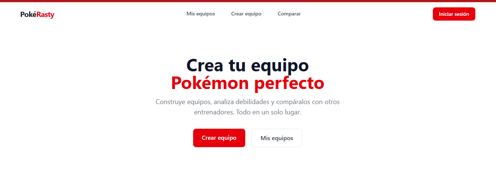
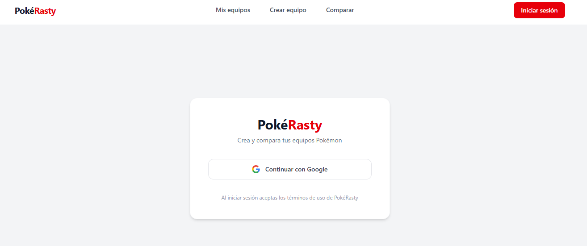
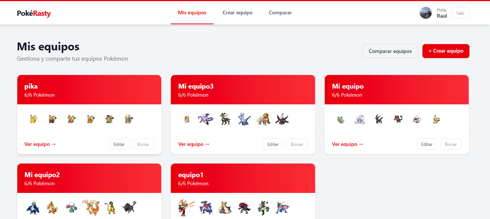
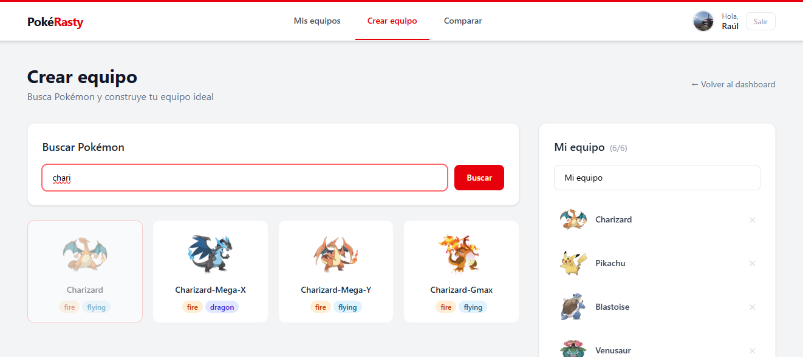
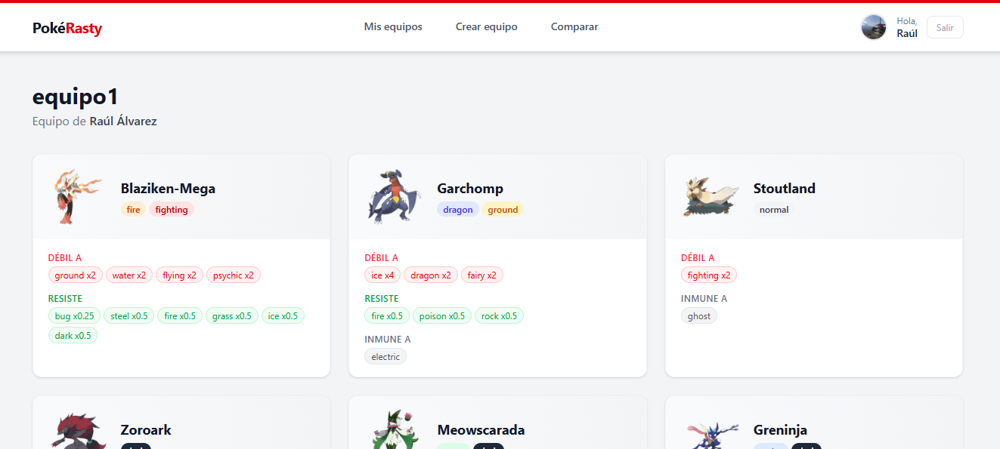
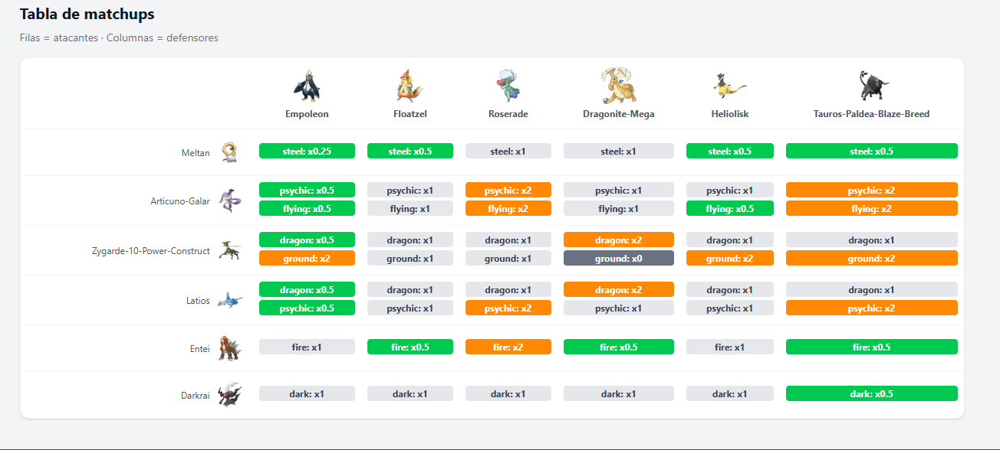
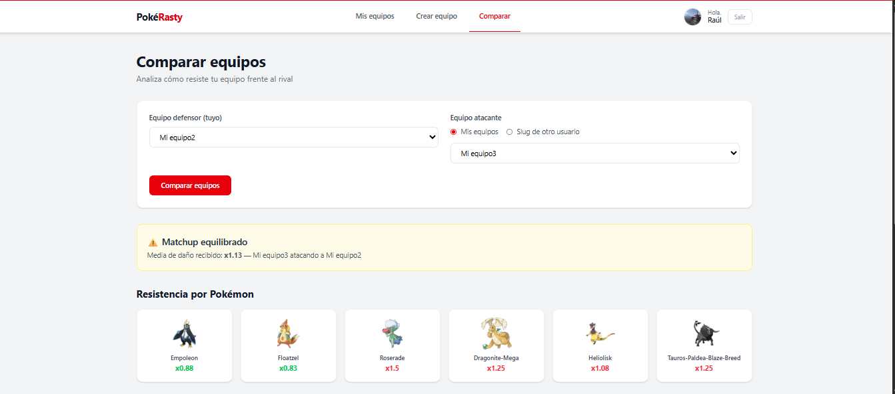

# PokéRasty

Aplicación web para crear, gestionar y comparar equipos Pokémon. Desarrollada con Next.js como proyecto de portfolio.

🌐 **Demo:** [pokerasty-calf.vercel.app](https://pokerasty-calf.vercel.app)

---

## Capturas de pantalla

### Página de inicio


### Login


### Dashboard de equipos


### Builder de equipos


### Análisis de debilidades


### Comparación de equipos



---

## Características

- **Autenticación** — Login con Google OAuth
- **Crear equipos** — Busca entre más de 1000 Pokémon y construye tu equipo de 6
- **Editar y borrar equipos** — Gestión completa de equipos
- **Análisis de debilidades** — Debilidades, resistencias e inmunidades por Pokémon y del equipo global
- **Comparar equipos** — Tabla de matchups con multiplicadores de daño entre dos equipos
- **Página pública** — Cada equipo tiene una URL pública para compartir

---

## Stack tecnológico

| Capa | Tecnología |
|------|-----------|
| Framework | Next.js 16 (App Router) |
| UI | React 19 + Tailwind CSS 4 |
| Autenticación | Auth.js v5 (Google OAuth) |
| ORM | Prisma 7 |
| Base de datos | Neon (PostgreSQL) |
| API externa | PokeAPI |
| Despliegue | Vercel |

---

## Estructura del proyecto

```
pokerasty/
├── app/
│   ├── (app)/
│   │   ├── builder/       # Constructor de equipos
│   │   └── dashboard/     # Panel de equipos del usuario
│   ├── (auth)/
│   │   └── login/         # Página de login
│   ├── api/
│   │   ├── auth/          # Endpoints de autenticación
│   │   ├── compare/       # API de comparación de equipos
│   │   ├── pokemon/       # API de búsqueda de Pokémon
│   │   └── teams/         # API CRUD de equipos
│   ├── compare/           # Página de comparación
│   └── team/[slug]/       # Página pública del equipo
├── components/
│   └── Navbar.jsx
├── lib/
│   ├── auth.js            # Configuración de Auth.js
│   ├── pokeapi.js         # Cliente de PokeAPI
│   ├── prisma.js          # Cliente de Prisma
│   └── weakness.js        # Lógica de tipos y debilidades
└── prisma/
    └── schema.prisma
```

---

## Instalación local

### Requisitos
- Node.js 18+
- Cuenta en [Neon](https://neon.tech)
- Credenciales de Google OAuth

### Pasos

1. Clona el repositorio
```bash
git clone https://github.com/raulrasty/Pokerasty-.git
cd Pokerasty-
```

2. Instala las dependencias
```bash
npm install
```

3. Crea el archivo `.env` con tus variables
```env
AUTH_SECRET=tu_secret
AUTH_GOOGLE_ID=tu_google_id
AUTH_GOOGLE_SECRET=tu_google_secret
NEXTAUTH_URL=http://localhost:3000
```

4. Configura `prisma.config.ts` con tu `DATABASE_URL` de Neon

5. Genera el cliente de Prisma
```bash
npx prisma generate
```

6. Arranca el servidor
```bash
npm run dev
```

---

## Autor

Raúl Álvarez — [GitHub](https://github.com/raulrasty)